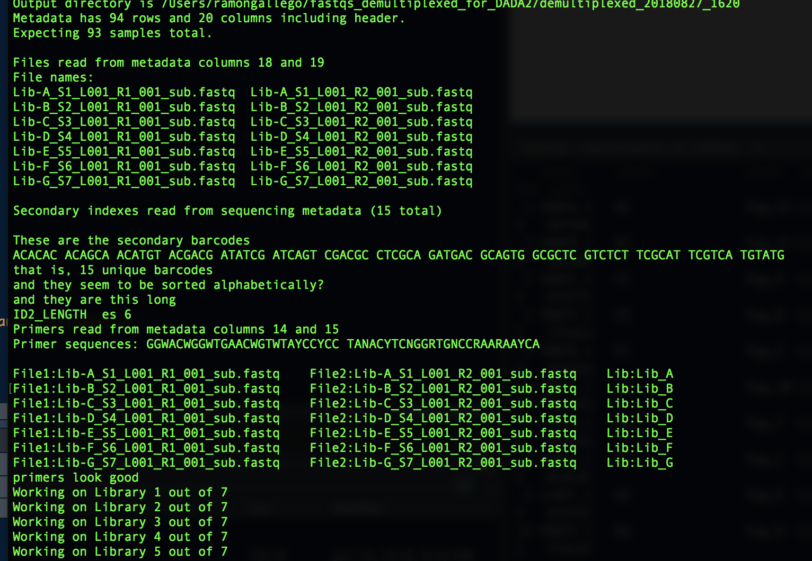

code_day
========================================================
author: Ramón Gallego
date: 20180827
autosize: true
<style>
.small-code pre code {
  font-size: 1em;
}
</style>

What does this pipeline do?
========================================================

Once you have retrieved all your sequences from the Illumina machine, you will need to asign them to the sample they came from,  and minimize the noise and cross-contamination inherent to this platform.

This pipeline will need the follwing **input** files:

- One or more pairs of fastq files
- A metadata file, with one row per sample, containing the information needed to demultiplex the sequences

```
# A tibble: 93 x 6
   sample_id Tag    pri_index_name sec_index_seq file1        file2       
   <chr>     <chr>  <chr>          <chr>         <chr>        <chr>       
 1 SA07A.1   Tag_12 Lib_B          GATGAC        Lib-B_S2_L0… Lib-B_S2_L0…
 2 SA07B.1   Tag_12 Lib_D          GATGAC        Lib-D_S4_L0… Lib-D_S4_L0…
 3 SA07C.1   Tag_4  Lib_B          GCGCTC        Lib-B_S2_L0… Lib-B_S2_L0…
 4 TR07A.1   Tag_8  Lib_G          CTCGCA        Lib-G_S7_L0… Lib-G_S7_L0…
 5 TR07B.1   Tag_2  Lib_A          ACAGCA        Lib-A_S1_L0… Lib-A_S1_L0…
 6 TR07C.1   Tag_10 Lib_B          TGTATG        Lib-B_S2_L0… Lib-B_S2_L0…
 7 LL07A.1   Tag_7  Lib_G          ATATCG        Lib-G_S7_L0… Lib-G_S7_L0…
 8 LL07B.1   Tag_1  Lib_A          ACACAC        Lib-A_S1_L0… Lib-A_S1_L0…
 9 LL07C.1   Tag_5  Lib_G          ACATGT        Lib-G_S7_L0… Lib-G_S7_L0…
10 PO07A.1   Tag_9  Lib_A          TCGCAT        Lib-A_S1_L0… Lib-A_S1_L0…
# ... with 83 more rows
```
- A parameters file, which will be the bridge between the pipeline and the metadata file 

What does this pipeline give you?
========================================================

In return, this pipeline will give you the composition of your samples. The **output** files are:

- ASV_Table: It is in a long format, with three columns: Hash, sample, nReads


```
# A tibble: 776 x 3
   sample  Hash                                     nReads
   <chr>   <chr>                                     <int>
 1 LL07B.1 c77678ba55303523ebfb97073b6920fb80c7b9db    132
 2 TR07B.1 c77678ba55303523ebfb97073b6920fb80c7b9db     96
 3 PO07C.3 c77678ba55303523ebfb97073b6920fb80c7b9db     77
 4 LL07C.2 c77678ba55303523ebfb97073b6920fb80c7b9db     79
 5 TW07C.2 c77678ba55303523ebfb97073b6920fb80c7b9db    195
 6 PO07A.1 c77678ba55303523ebfb97073b6920fb80c7b9db     99
 7 TR07A.2 c77678ba55303523ebfb97073b6920fb80c7b9db    125
 8 TW08B.2 c77678ba55303523ebfb97073b6920fb80c7b9db      5
 9 LL07A.2 c77678ba55303523ebfb97073b6920fb80c7b9db     89
10 PO07A.2 c77678ba55303523ebfb97073b6920fb80c7b9db     40
# ... with 766 more rows
```

- Hash_key: In case you used hashing, the key to convert sequences to hashes


```
# A tibble: 119 x 2
   Hash                       Sequence                                    
   <chr>                      <chr>                                       
 1 c77678ba55303523ebfb97073… TTTAAGTGGAATCCTAGCACATTCTGGAGGATCTGTAGATCTT…
 2 8a1c9da427aa6f155aaa44acd… TCTAGCAGGGATTCAAGCTCATTCAGGAGGTTCTGTTGATTTA…
 3 a64ab751b69ad1c2dc4581495… ACTAAGTCATATTACTAGTCACTCAGGAGGTGCTGTAGATTTA…
 4 11a112ced1c85e620f6d97d82… TCTAAGTCATATTACGAGCCACTCTGGTGGTGCAGTTGATTTA…
 5 9c1b08211a76599faa4a6763b… ACTTTCAAGTGGTACGTCTCACTCTGGTGGAGCTGTTGATCTA…
 6 bccac54ad7babc9191848eab0… ACTCTCTTCCAAGAAATACTCTTCCAGCTTTAATATGGATATT…
 7 a31d4e16bf8a39f654272a118… ATTATCAAGTATTGCAAGCCACTCTGGAGGTGCTGTAGACTTA…
 8 bc6b1aeae602820e9af677632… TCTTTCAAGTGGAACTTCTCATTCAGGTGGAGCTGTTGATTTA…
 9 5ea3e5f9f5b217b39bc303871… ATTAGCAAGTATTGCATTCCACTCAGGAGGAGCAGTTGATTGT…
10 422d4fe71439b6a3fcf11eb88… TCTTTCAGGTATTATTGCACACTCAGGAGGTTCTGTAGATTTA…
# ... with 109 more rows
```
- A bunch of summary files and general clutter

Getting started
========================================================


- Download the last version of the pipeline. If you use git or github, open the terminal and type 

`git clone https://github.com/ramongallego/demultiplexer_for_DADA2.git <directory>`

If not, you can just browse to  https://github.com/ramongallego/demultiplexer_for_DADA2 and use the ZIP download option

- Before we started using dada2 for clustering sequences, we used jimmy O'donnell's pipeline. You can get it at

`git clone https://github.com/jimmyodonnell/banzai.git <directory2>`


Dependencies
========================================================

Here is a list of dependencies you should have for running both pipelines

- cutadapt

- vsearch 

- swarm

- seqtk

- blast+

- python

- pandoc

- and a lot of **R** packages:
  
    - data.table
    - devtools
    - reshape2
    - vegan
    - taxize
    - tidyverse
    - stringr
    - dada2
    - Biostrings
    - digest
    - rmarkdown
    - knitr

The parameters file
========================================================

The parameters file tells the script where to look for the appropiate information in the metadata file, and allows you to choose amongst different options for your run.

We will go through them later on, but for now we will have to focus on one:


This directory must exist in your drive, so if you haven't created one, do it now.

Doing a test Run: demultiplexer_for_dada2
========================================================

Just to check that you have installed everything you need, let's do a test run

`bash <ppath/to/dir>/demultiplex_both_fastqs.sh <path/to/dir>/banzai_params_for_dada2.sh`

The test run takes about two minutes to run, and you should see it progress like this


```r

```


Doing a test Run: banzai
======================================


Similar concept, just try 

`bash <path/to/dir>/banzai.sh test`

If you succeed, you should see 


The pipeline script
====================

- The first part looks for the parameters file, the metadata file and creates all the directory it needs to get started

- Then, under the READ METADATA section, it loads all the info from the metadata file 
